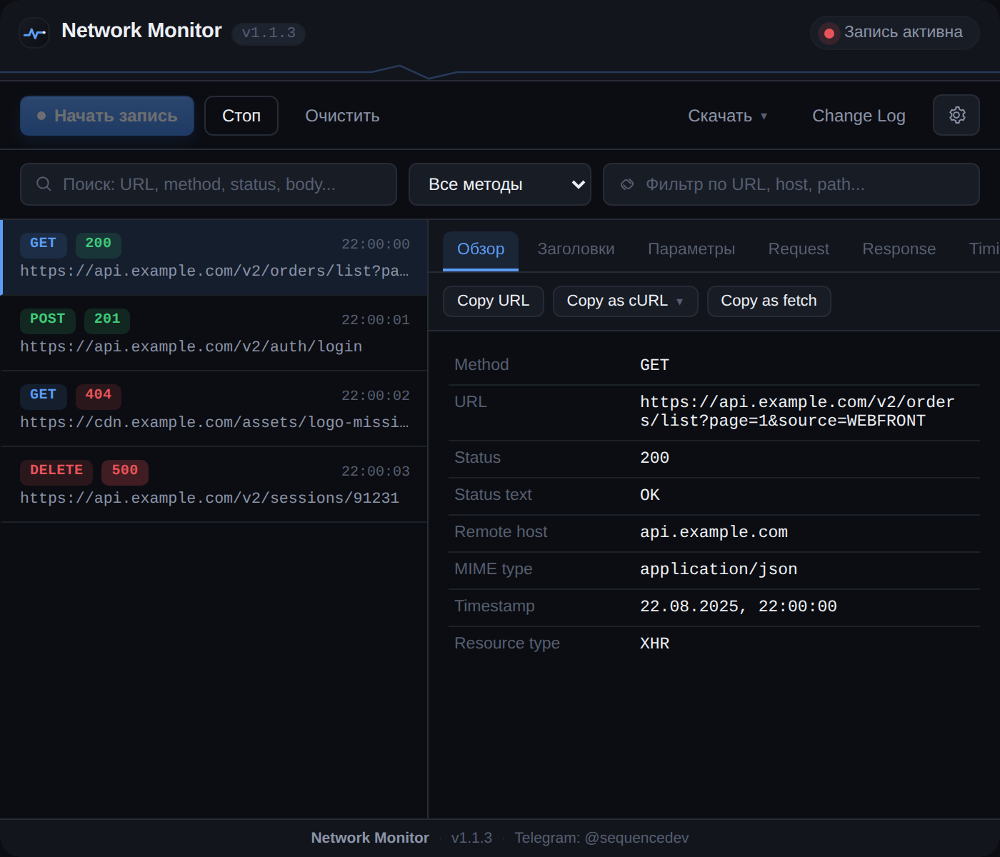

# Network Monitor

<div align="center">


# Network Monitor

**Локальный мониторинг сетевых запросов текущей вкладки Chrome — компактный аналог DevTools Network со своим интерфейсом**

<a href="#-о-проекте">

</a>
<a href="#-архитектура">

</a>
<a href="#-архитектура">

</a>
<a href="#requirements">

</a>
<a href="#-лицензия">

</a>

<sub>Автор и правообладатель: GitHub <a href="https://github.com/ownersystem"><b>@ownersystem</b></a></sub>

</div>

---



---

## 📖 Оглавление

- [О проекте](#-о-проекте)
- [Возможности](#-возможности)
- [Требования](#requirements)
- [Установка](#-установка)
- [Разработка](#-разработка)
- [Сборка](#-сборка)
- [Загрузка в Chrome](#-загрузка-в-chrome)
- [Использование](#-использование)
- [Права доступа](#-права-доступа)
- [Безопасность](#-безопасность)
- [Архитектура](#-архитектура)
- [Troubleshooting](#-troubleshooting)
- [Лицензия](#-лицензия)

---

## 🧭 О проекте

**Network Monitor** — расширение для Chrome (Manifest V3, строгий TypeScript), которое перехватывает сетевые запросы активной вкладки через `chrome.debugger` и Chrome DevTools Protocol — включая **тело ответа**, а не только заголовки. Собственный тёмный интерфейс, поиск, фильтры, маскирование секретов и экспорт — без единого байта данных, уходящего на внешний сервер.

## ✨ Возможности

| | |
|---|---|
| 🛰️ **Полный перехват** | GET / POST / PUT / PATCH / DELETE / OPTIONS / HEAD через CDP (`Network.*`), включая `Network.getResponseBody` |
| 🔍 **Поиск и фильтры** | По URL, методу, статусу, hostname, pathname и телу ответа |
| 🧾 **Детали запроса** | Обзор · Заголовки · Параметры · Request · Response · Timing |
| 🔒 **Маскирование секретов** | `token`, `authorization`, `cookie`, `password`, `api_key` и др. — скрыты по умолчанию везде, включая экспорт и копирование |
| 📋 **Copy as cURL / fetch** | Unix и Windows варианты, с автоудалением `Cookie` / `Authorization` / `Proxy-Authorization` |
| 💾 **Экспорт** | JSON / TXT — для всех запросов или одного выбранного |
| 🩺 **On-page индикатор** | Ненавязчивый overlay в Shadow DOM, с минимальным режимом |
| 🧮 **Лимиты памяти** | До 2000 запросов на вкладку, до 5 MB на тело ответа |
| 🗂️ **Мульти-таб** | Отдельная запись для каждой вкладки без смешивания данных |
| 🔔 **Тост-уведомления** | Подтверждение «Скопировано» при любом действии копирования |
| 🚫 **Zero-telemetry** | Никакой аналитики, никакой отправки данных куда-либо, кроме самого браузера пользователя |

## Requirements

- Node.js 18+
- Chrome 110+

## 📦 Установка

```bash
npm install
```

## 🛠 Разработка

```bash
npm run dev
```

Watch-режим на esbuild — пересобирает `dist/` при изменении файлов в `src/`.

## 🏗 Сборка

```bash
npm run build
```

После сборки появляется каталог `dist/` — полностью готовый к загрузке в Chrome, без ручного копирования файлов.

## 🚀 Загрузка в Chrome

1. Откройте `chrome://extensions/`.
2. Включите **«Режим разработчика»** (Developer mode) в правом верхнем углу.
3. Нажмите **«Загрузить распакованное расширение»** (Load unpacked).
4. Выберите каталог `dist/`.

## 🎯 Использование

1. Откройте вкладку, трафик которой нужно проанализировать.
2. Кликните по иконке расширения и нажмите **«Начать запись»**.
3. Chrome покажет системное предупреждение о подключении отладчика — это нормально и необходимо для получения Network-событий через CDP.
4. Список запросов заполняется в реальном времени. Клик по запросу открывает детали.
5. Используйте поиск, фильтр по методу и фильтр по URL, чтобы найти нужный запрос.
6. **«Стоп»** останавливает запись без потери списка. **«Очистить»** удаляет собранные запросы.
7. **«Скачать»** — экспорт в JSON/TXT, с учётом текущей настройки маскирования секретов.

## 🔑 Права доступа

| Permission | Зачем нужен |
|---|---|
| `debugger` | Подключение к вкладке через Chrome DevTools Protocol для получения Network-событий и тела ответа (`Network.getResponseBody`). Без этого нельзя прочитать response body. |
| `storage` | Сохранение настроек (фильтры, состояние overlay) через `chrome.storage.local`. |
| `downloads` | Скачивание JSON/TXT дампов через кнопку «Скачать». |
| `activeTab` / `tabs` | Определение активной вкладки, получение её URL/заголовка, отправка сообщений в content script конкретной вкладки. |
| `host_permissions: <all_urls>` | Необходимо для работы `chrome.debugger` на произвольных сайтах и для internal-инъекции content-script overlay. |

## 🛡 Безопасность

- Расширение **не отправляет** URL, cookies, заголовки или тела запросов на внешние серверы — весь трафик обрабатывается локально в браузере.
- Секретные значения (`token`, `authorization`, `cookie`, `password`, `api_key`, `session` и т.п.) маскируются **по умолчанию** в интерфейсе, при копировании и при экспорте — единообразно.
- В Copy as cURL/fetch заголовки `Cookie`, `Authorization`, `Proxy-Authorization` заменяются на `SECRET_HEADER_REMOVED`.
- Никакой сторонней аналитики или телеметрии — вообще.
- Секретные данные не логируются в консоль service worker.

## 🏛 Архитектура

```text
src/
  background/
    background.ts   — точка входа service worker, маршрутизация сообщений, badge
    network.ts      — состояние по вкладкам, обработка событий CDP, response body
    debugger.ts       — низкоуровневая обёртка над chrome.debugger
    storage.ts         — персистентность настроек (chrome.storage.local)
    security.ts        — безопасное логирование, лимиты размера тела ответа
  popup/
    popup.html/ts/css — интерфейс popup: список, фильтры, детали, экспорт
  content/
    overlay.ts/css      — статусный overlay на странице (Shadow DOM)
  shared/
    types.ts             — общие типы и протокол сообщений
    constants.ts           — константы (лимиты, список секретных ключей и т.д.)
    utils.ts                 — парсинг URL, форматирование, детект типа тела
    sanitize.ts                — маскирование секретов для UI/экспорта
    generators.ts                — генерация cURL/fetch сниппетов
```

Данные запросов хранятся **в памяти service worker** (не в `chrome.storage`), чтобы не хранить потенциально большие response body бесконечно. Настройки (не сами дампы) сохраняются в `chrome.storage.local`.

### Известное ограничение Manifest V3

Service worker может быть выгружен Chrome при простое. Пока к вкладке активно подключён `chrome.debugger` и приходят сетевые события, worker остаётся активным. При выгрузке во время простоя между запросами накопленные в памяти данные текущей записи могут быть потеряны — это архитектурное ограничение MV3 service worker. При навигации с пересозданием процесса (`target_closed`) расширение автоматически пытается переподключить debugger и продолжить запись.

## 🧯 Troubleshooting

**Chrome показывает жёлтую полосу «расширение отлаживает эту страницу»**

Стандартное поведение при использовании `chrome.debugger` API — так браузер сообщает, что к вкладке подключён отладчик. Исчезает после нажатия «Стоп».

**Response body недоступен**

Появляется, если тело ответа не готово на момент запроса, запрос отменён/редиректится, является streaming-ответом или произошёл до начала записи. Это ожидаемое поведение, а не ошибка.

**Overlay не появляется на странице**

Проверьте настройку «Показывать индикатор на странице» в popup (⚙). На `chrome://`-страницах и в Chrome Web Store content scripts не работают — это ограничение самого Chrome.

**Часть интерфейса обрезана и не видна**

Прокрутите нужную область колесом мыши или зажатой левой кнопкой (drag) — горизонтальный скролл работает как для отдельных рядов вкладок/кнопок, так и для всего окна popup целиком.

## ⚖️ Лицензия

Полный текст лицензии в [`LICENSE.md`](LICENSE.md).

Коротко: копировать, форкать, изменять и распространять код можно свободно. Обязательное условие одно: в любой копии, форке или изменённой версии должно быть явно указано, что автором и правообладателем проекта является GitHub **[@ownersystem](https://github.com/ownersystem)**. Удалять, прятать или подменять это указание нельзя, это нарушает лицензию и лишает прав на использование ПО.

---

<div align="center">
<sub>Network Monitor · GitHub <a href="https://github.com/ownersystem">@ownersystem</a></sub>
</div>
